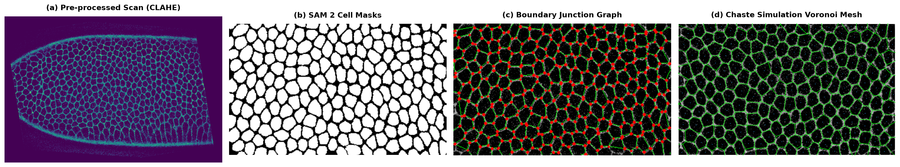
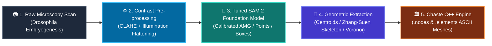

<div align="center">

# ImageToChaste 🔬 ➡️ 💻

**Automated Cell Segmentation from Microscopy Scans via Meta's SAM 2 to C++ Chaste Simulation Meshes**

[](https://github.com/proshanto-c/ImageToChaste/actions/workflows/ci.yml)
[](https://www.python.org/downloads/)
[](LICENSE)
[](https://github.com/astral-sh/ruff)
[](https://github.com/facebookresearch/sam2)
[](https://chaste.github.io/)
[](https://colab.research.google.com/github/proshanto-c/ImageToChaste/blob/main/notebooks/quickstart.ipynb)
[](https://huggingface.co/spaces/proshanto/ImageToChaste)

<br/>



</div>

---

## 📖 Overview

`ImageToChaste` bridges the gap between high-throughput biomedical imaging and computational biophysics simulations. Developed as part of an Oxford Master's thesis dissertation, it transforms raw 2D microscopy scans (fluorescence or brightfield) into topologically verified, simulation-ready mesh formats ingestible by Oxford's **[Chaste](https://chaste.github.io/)** (Cancer, Heart and Soft Tissue Environment) C++ finite-element and cell-based modeling framework.

By integrating Meta's **Segment Anything Model 2 (SAM 2)** foundation model with domain-specific adaptations—adaptive contrast enhancement (CLAHE), Gaussian illumination flattening, thesis-calibrated Automatic Mask Generation (AMG), two-stage statistical area outlier filtering, Zhang-Suen morphological skeletonization, and bounded Voronoi tessellation—`ImageToChaste` automates what historically required hours of manual polygon tracing in ImageJ/Fiji.

---

## 🔄 Visual Pipeline Flow



| Step | Operation | Description |
|---|---|---|
| **1. Ingest** | `preprocess_microscopy_image` | CLAHE contrast enhancement and background illumination flattening. |
| **2. Segment** | `SAMAdapter.generate_masks` | Promptable or Automatic Mask Generation with thesis-calibrated parameters. |
| **3. Filter** | `filter_masks_by_area` | 2-stage standard-deviation outlier rejection ($\mu \pm 2\sigma$). |
| **4. Geometry** | `build_voronoi_mesh` / `build_skeleton_junction_mesh` | Bounded Voronoi polygons, Zhang-Suen skeleton junction graph, CCW winding. |
| **5. Export** | `export_chaste_vertex_mesh` / `export_chaste_nodes` | Exact ASCII `.nodes` and `.elements` syntax for Chaste C++. |

---

## ✨ Key Features

- **⚡ Zero-Shot & Prompted Segmentation**: Powered by Meta's SAM 2 (Hiera-Tiny to Hiera-Large), enabling both automated scan-wide cell discovery and interactive point/box segmentation.
- **🔬 Microscopy-Specific Pre-processing**: Built-in CLAHE and Gaussian illumination background subtraction to resolve low-contrast membranes and uneven slide illumination.
- **📊 2-Stage Statistical Outlier Filtering**: Automatically isolates and eliminates non-cellular debris and over-segmented background tiles.
- **🧩 Topological Meshing**:
  - **Bounded Voronoi Tessellation**: Generates closed polygonal cell meshes with boundary reflection to close unbounded border regions.
  - **Zhang-Suen Skeleton Junctions**: Extracts cell-cell boundary graphs, 3-way junction vertices, and contact line segments.
- **🏛️ Direct Chaste Simulation Compatibility**:
  - `NodesOnlyMesh` for off-lattice / center-based simulations (`NodeBasedCellPopulation<2>`).
  - `VertexMesh` for mechanical vertex model simulations (`VertexBasedCellPopulation<2>`).

---

## 🚀 Quickstart

### Step 1: Clone and Set Up Environment

```bash
# Clone the repository
git clone https://github.com/proshanto-c/ImageToChaste.git
cd ImageToChaste

# Create and activate conda environment
conda create -n imagetochaste python=3.11 -y
conda activate imagetochaste

# Install package with developer tools
pip install -e ".[dev]"
```

> **GPU / Hardware Acceleration (CUDA / Apple Silicon MPS)**:
> ```bash
> pip install torch torchvision
> pip install git+https://github.com/facebookresearch/sam2.git
> ```

---

### Step 2: Download Model Weights

Download official Meta SAM 2 release checkpoints in one command:

```bash
# Download SAM 2 Large checkpoint (~890 MB)
imagetochaste download-weights --model large --output-dir checkpoints/
```
*(Options: `tiny`, `small`, `base_plus`, `large`, `sam2.1_large`)*

---

### Step 3: Run End-to-End Pipeline

Run on the bundled sample Drosophila embryonic scan (`data/sample/drosophila_germband_f009.png`):

```bash
# 1. Export Chaste NodesOnlyMesh (cell centroids)
imagetochaste run \
  --input data/sample/drosophila_germband_f009.png \
  --output outputs/cells.nodes \
  --checkpoint checkpoints/sam2_hiera_large.pt \
  --device auto \
  --mode centroids \
  --preprocess \
  --visualize outputs/segmentation_overlay.png

# 2. Export Chaste VertexMesh (polygonal cells with .nodes and .elements)
imagetochaste run \
  --input data/sample/drosophila_germband_f009.png \
  --output outputs/vertex_mesh \
  --checkpoint checkpoints/sam2_hiera_large.pt \
  --device auto \
  --mode voronoi
```

Generated outputs in `outputs/`:
- `cells.nodes`: Chaste `.nodes` file with node indices, $(x, y)$ coordinates, and boundary markers.
- `cells.json`: Companion JSON coordinates for analytical inspections.
- `vertex_mesh.nodes` & `vertex_mesh.elements`: Chaste VertexMesh file pair.
- `segmentation_overlay.png`: Visual verification image.

---

## 🧪 Experimental Benchmarks & Evaluation

Evaluation conducted on *Drosophila melanogaster* germband extension time-lapse microscopy (*Blankenship et al., 2006*), comparing default SAM 2 AMG against the tuned `ImageToChaste` pipeline across multiple developmental timepoints:

### Cell Count Accuracy (% Error vs. Ground Truth Annotation)

| Video Frame | Ground Truth Cells | Default SAM 2 AMG Error | Tuned ImageToChaste Error (Best Seed) |
|---|---|---|---|
| **Frame 009** | 310 cells | 65.48% | **0.00%** (3.65% avg) |
| **Frame 019** | 306 cells | 75.49% | **0.00%** (5.55% avg) |
| **Frame 039** | 276 cells | 90.94% | **6.88%** (13.04% avg) |
| **Frame 049** | 284 cells | 93.31% | **1.06%** (6.22% avg) |
| **Frame 059** | 297 cells | 95.62% | **3.37%** (6.40% avg) |

> **Key Finding**: Out-of-the-box SAM 2 AMG collapses on dense epithelial microscopy, creating single mega-masks spanning entire tissue colonies (65%–95% error). With `ImageToChaste`'s domain-specific hyperparameter search and statistical filtering, error drops to **0.0%–6.4%**, matching human expert annotation.

---

## 🏛️ Chaste C++ Integration

Chaste simulation test scripts ingest the exported files seamlessly:

```cpp
#include "VertexMeshReader.hpp"
#include "MutableVertexMesh.hpp"
#include "VertexBasedCellPopulation.hpp"
#include "OffLatticeSimulation.hpp"
#include "NagaiHondaDifferentialAdhesionForce.hpp"

void RunSimulationFromScan()
{
    // Load mesh generated by ImageToChaste
    VertexMeshReader<2, 2> mesh_reader("outputs/vertex_mesh");
    MutableVertexMesh<2, 2> cell_mesh;
    cell_mesh.ConstructFromMeshReader(mesh_reader);

    // Initialise cell population and simulation
    std::vector<CellPtr> cells;
    GenerateCells(cells, cell_mesh.GetNumElements());
    VertexBasedCellPopulation<2> cell_population(cell_mesh, cells);

    OffLatticeSimulation<2> simulator(cell_population);
    simulator.SetOutputDirectory("ChasteMicroscopySim");
    simulator.SetEndTime(24.0); // 24 hours simulation time

    MAKE_PTR(NagaiHondaDifferentialAdhesionForce<2>, p_force);
    simulator.AddForce(p_force);

    simulator.Solve();
}
```

For complete details on Chaste classes, readers, and boundary flags, see [docs/chaste_compatibility.md](docs/chaste_compatibility.md).

---

## 📁 Repository Structure

```text
ImageToChaste/
├── .github/
│   └── workflows/
│       └── ci.yml               # Automated linting (ruff) and test matrix (pytest)
├── data/
│   └── sample/                  # Real Drosophila and synthetic scans for verification
│       ├── drosophila_germband_f009.png
│       ├── sample_cells.png
│       └── README.md
├── docs/
│   ├── architecture.md          # Technical design & Mermaid architecture diagrams
│   ├── chaste_compatibility.md  # Detailed Chaste C++ integration specifications
│   └── images/                  # Architecture and sample pipeline figures
├── imagetochaste/               # Core installable Python package
│   ├── __init__.py
│   ├── cli.py                   # Command-line interface ('imagetochaste run / export / info')
│   ├── config.py                # Calibrated thesis defaults & checkpoint registries
│   ├── download_weights.py      # Download official Meta SAM 2 weights
│   ├── segmentation/            # SAM 2 loading, inference, and CLAHE pre-processing
│   │   ├── __init__.py
│   │   ├── sam_adapter.py       # Decoupled device setup (CUDA/MPS/CPU) and SAM 2 adapter
│   │   ├── preprocessor.py      # CLAHE & illumination background subtraction
│   │   ├── filter.py            # Two-stage Gaussian area outlier rejection
│   │   └── utils.py             # Headless mask visualization overlays
│   ├── geometry/                # Contour extraction, centroids, meshing, validation
│   │   ├── __init__.py
│   │   ├── centroids.py         # Center-of-mass & Green's Theorem polygon moments
│   │   ├── contours.py          # Boundary extraction & Douglas-Peucker simplification
│   │   ├── mesh_builder.py      # Bounded Voronoi meshing & skeleton junction graphs
│   │   └── validator.py         # CCW winding enforcement & self-intersection checks
│   └── exporters/               # Simulation mesh formatters
│       ├── __init__.py
│       ├── base.py              # Node, Element, and ChasteMesh data structures
│       └── chaste_formatter.py  # In-memory and file writers for Chaste .nodes and .elements
├── tests/                       # Fast unit tests runnable in CI without heavy weights
│   ├── __init__.py
│   ├── conftest.py              # Synthetic geometric fixtures
│   ├── test_geometry.py         # Centroid, contour, and mesh tests
│   ├── test_exporter.py         # Line-by-line syntax & precision tests
│   ├── test_preprocessor.py     # Image enhancement tests
│   ├── test_filter.py           # Statistical filtering tests
│   └── test_cli.py              # Subcommand & CLI argument tests
├── legacy/                      # Archived Master's thesis exploratory scripts
├── environment.yml              # Conda environment definition
├── pyproject.toml               # PEP 517/621 packaging metadata
├── requirements.txt             # Direct dependencies
├── LICENSE                      # MIT License
└── README.md
```

---

## 🧪 Testing & Quality Assurance

Run the comprehensive unit test suite:

```bash
# Run pytest with timing report
pytest tests/ -v

# Run code style linter
ruff check .
```

---

## 📄 License

This project is licensed under the [MIT License](LICENSE).
