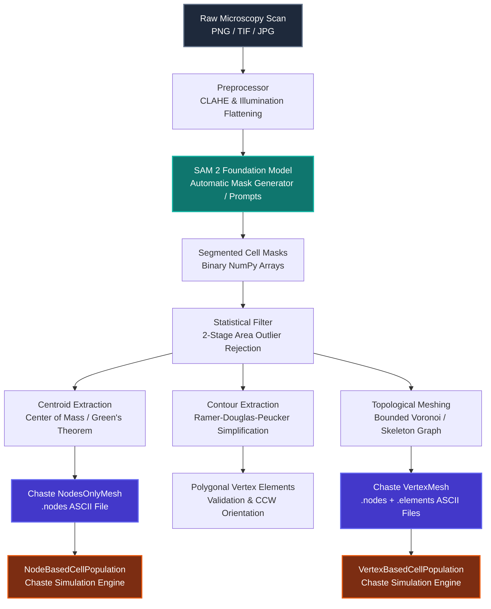
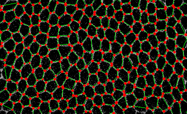
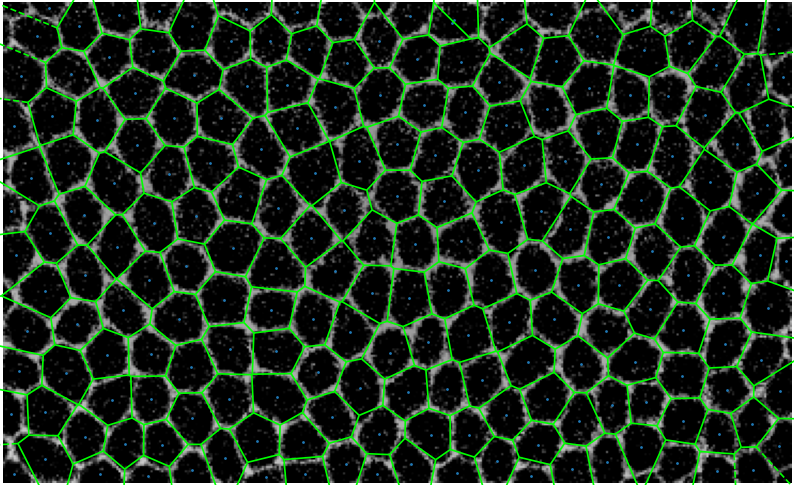

# ImageToChaste System Architecture

## 1. High-Level Pipeline Architecture

The `ImageToChaste` pipeline transforms raw microscopy image scans into topologically verified, simulation-ready spatial meshes for the C++ [Chaste](https://www.cs.ox.ac.uk/chaste/) framework.

---

## 2. Core Subsystems

### 2.1 Segmentation Module (`imagetochaste.segmentation`)
- **`preprocessor.py`**:
  Microscopy fields frequently suffer from uneven illumination and weak cell-edge contrast. The preprocessor applies Contrast Limited Adaptive Histogram Equalization (CLAHE) followed by Gaussian background estimation and subtraction ($I_{\text{flat}} = I_{\text{clahe}} - G_{\sigma}(I_{\text{clahe}})$), normalizing dynamic range.
- **`sam_adapter.py`**:
  Decoupled interface wrapping Meta's Segment Anything Model 2 (SAM 2). Handles device acceleration (`cuda`, `mps`, `cpu`), automatic precision management (`bfloat16`, `tf32`), and exposes:
  - Automatic Mask Generation (AMG) with grid-based prompt sampling.
  - Interactive single/multi-point and bounding box prompt inference.
  - Two-stage tissue-to-cell hierarchical segmentation.
- **`filter.py`**:
  Two-stage Gaussian distribution outlier rejection:
  $$\text{Stage 1: } A_i \le \mu_1 + 3\sigma_1$$
  $$\text{Stage 2: } \mu_2 - 2\sigma_2 \le A_i \le \mu_2 + 2\sigma_2$$
  Effectively strips gross background artifacts and debris while retaining realistic confluent cell distributions.

---

### 2.2 Geometry Engine (`imagetochaste.geometry`)
- **`centroids.py`**:
  Computes pixel-weighted center of mass for binary masks:
  $$C_x = \frac{1}{N}\sum x_i, \quad C_y = \frac{1}{N}\sum y_i$$
  And analytical polygonal centroids using Green's Theorem for closed loops:
  $$A = \frac{1}{2} \sum_{i=0}^{n-1} (x_i y_{i+1} - x_{i+1} y_i)$$
  $$C_x = \frac{1}{6A} \sum_{i=0}^{n-1} (x_i + x_{i+1})(x_i y_{i+1} - x_{i+1} y_i)$$
- **`contours.py`**:
  Extracts topological boundary polygons using `cv2.findContours` and performs Ramer-Douglas-Peucker (RDP) piecewise linear curve simplification parameterized by $\epsilon = k \cdot \text{perimeter}$.
- **`validator.py`**:
  Enforces simulation invariants:
  - Minimum 3 vertices per cell element.
  - Absence of NaN/Inf coordinates.
  - Self-intersection avoidance via line segment cross-product testing.
  - Counter-Clockwise (CCW) winding order enforcement for positive geometric Jacobian in finite element / vertex equations.
- **`mesh_builder.py`**:
  - **Bounded Voronoi Tessellation**: Mirrors centroids across the image bounding box to close infinite Voronoi rays into well-formed perimeter polygons.
  - **Zhang-Suen Skeleton & Junction Graph**: Thinning-based boundary graph extraction via the iterative Zhang-Suen morphological thinning algorithm, 3-way vertex junction isolation ($N(p) \ge 3$), and NetworkX path-tracing.

| Boundary Junction Graph | Centroid Voronoi Overlay |
|---|---|
|  |  |

---

### 2.3 Simulation Exporters (`imagetochaste.exporters`)
- Formats computational representations into exact Chaste ASCII syntax.
- Completely decoupled from disk I/O, writing either to in-memory string streams (for unit testing) or files.
- Generates:
  1. `.nodes`: Node index, $(x, y)$ coordinates formatted to 6 decimal precision, and boundary marker flag ($0$ for interior, $1$ for boundary).
  2. `.elements`: Element index, node count, and counter-clockwise vertex indices.
